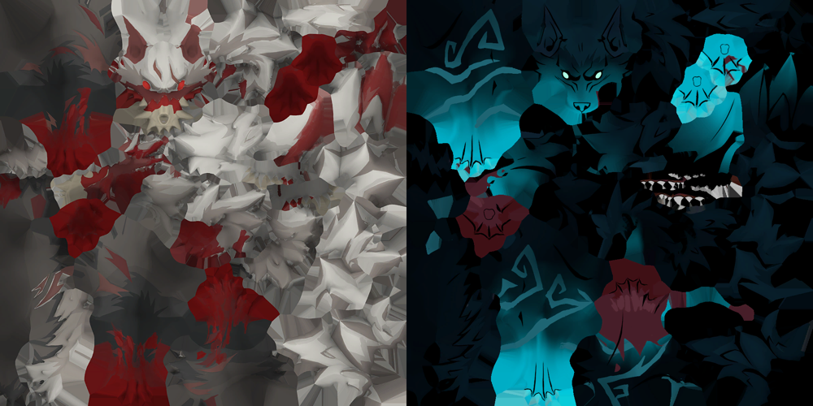

# Moonlit Alphas

Alpha wolves come back wearing Melion's runebound pelt — dark fur, glowing cyan
sigils, pale eyes. Common wolves are untouched.



*Left: vanilla Alpha. Right: what this mod gives it.*

## Install

```
rsmm enable moonlit-alphas
rsmm apply
```

`rsmm restore` puts the originals back.

## What this is, and is not

**Only you see it.** Asset overrides replace files in your own install, so in
co-op every other player renders their own vanilla wolves. Nothing about this
is shared, synced, or visible to anyone else — that is what
`multiplayer_scope = "cosmetic"` means here, and it is true of every texture
mod in RSMM, not just this one.

**It ships Melion's pixels, not a pointer to them.** `assets/` holds two real
DDS files — Melion's albedo and MRA maps, decoded once from the game's cooked
`oCTexture` and re-encoded as plain DDS (BC1, 1024×1024). The mod does not
read anything from your install at apply time; it is not a re-point, it is a
copy baked in ahead of time. The ceiling on it is still whatever the game
shipped (this borrows Melion's art rather than authoring new art) — if you
want a wolf that looks like nothing in the base game, that needs a real
authored `.dxt`, the way `Archive/JulietReskin` does it.

## How it works

`assets/3D/Characters/Enemies/Wolves/Textures/T_Wolf_Alpha_{ALB,MRA}.tga.Texture.dxt`
are the baked DDS files. `rsmm apply` finds them through the normal
assets/<decoded_path> drop-in convention, `cook_cache` re-cooks each into a
valid `oCTexture` container for that target, and the result replaces the
Alpha's maps. There is no loader involvement and no dependency on the game
tree beyond the target files themselves, so this reproduces identically on
any install and cannot crash anything.

The two assets are safe partners because they share a mesh: their UV coverage
has an IoU of **1.0000** and both maps are 1024×1024. That check is the whole
trick to texture swaps — borrow from a different creature and the detail lands
on the wrong parts of the model.
